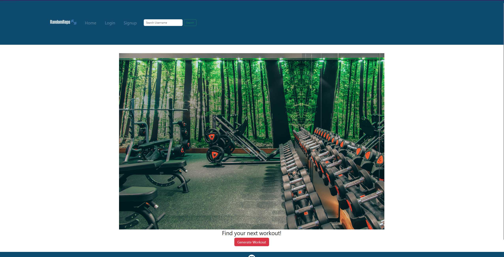

# DINE HARD

Welcome to Random-Reps! A website that takes care of your workout needs. In hurry and don't know have a workout, then just select which exercises you want and hit generate workout.

## Table of Contents ##
1. [Welcome](./README.md#description)
3. [Technology](./README.md#technology)
2. [Installation](./README.md#installation)
4. [Functionality](./README.md#Functionality)
5. [Screenshot](./README.md#Screenshot)
6. [Deployed Application](./README.md#deployed-application)

## Technology

This application is based on the MERN stack and utilizes React, Vite, React Bootstrap, Apollo/GraphQL, JWT, and a bit of Sass for the front end. The back end utilizes ExpressJS, MongoDB, Apollo/GraphQL, and Mongoose.

## Installation ##

To install this application, first enter your terminal, run 'npm i', then run the following: 
```
npm i
npm run develop
```

## Funtionality

Users can expect the following app functionality:

* When users initially visit the site, they are presented with a homepage that has a navigation contain login or sign up buttons and a generate workout button
* Users can generate a workout without creating an account
* Users can make an account if they want to save their workouts
* Once logged in/signed up, a user can visit their profile page to see their saved workouts.
* Users can search for other users and visit their profiles to see their saved workouts.
* Finally, the user can log out from the navigation.

## Screenshot



## Deployed Application

[Here is a link to the deployed application!](https://afternoon-everglades-28793-2b4d32cb92bf.herokuapp.com/)